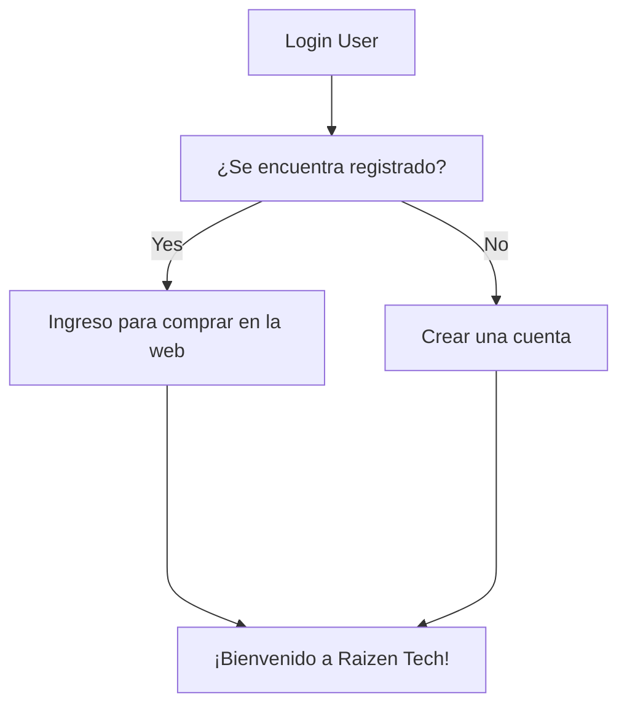

## Welcome to SPDA - Agua Santa Clara S.A.C! 🧐
**Instalación:**

Se debe contar con VS Code para poder clonar el proyecto y contar con las extensiones de .net y C# para evitar posibles errores.

>Tu aliado logístico!

### Introducción:

SPDA es una software de gestión que busca digitalizar y automatizar su proceso de pedidos y distribución mediante una plataforma online.

Algunos testimonios de nuestros clientes:
>Buen sitio. - **Franchesco Hernandez**

>Muy contenta con el control de pedidos a través de su sitio web. - **Rafaella Alcántara**

### Funcionalidades:

SPDA presenta una interfaz agradable para el usuario, dinámica e interactiva. Entre ellas destacan el modulo de inventarios, usuarios y finanzas.

##### Diagrama de flujo sencillo de login

### Prueba Online

SPDA cuenta con un live demo disponible en https://link. Los usuarios pueden explorar el sistema en línea, navegar por los distintos módulos y crear pedidos de prueba.
